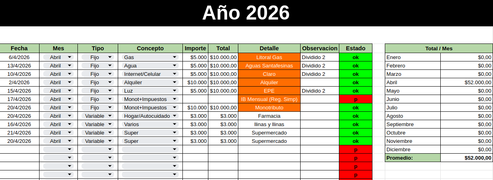
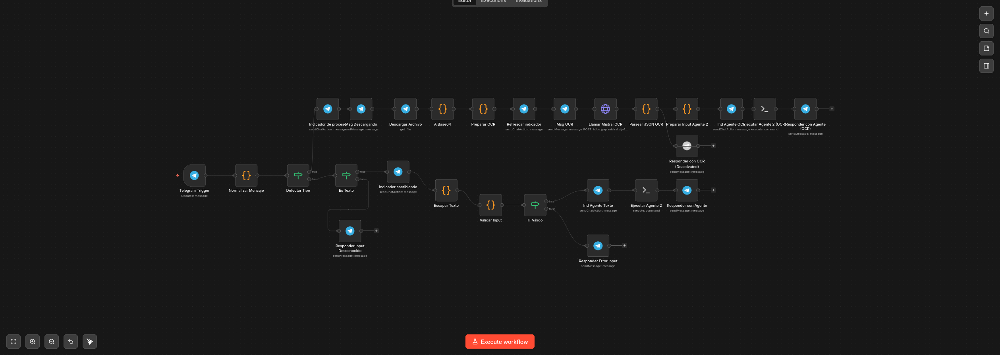
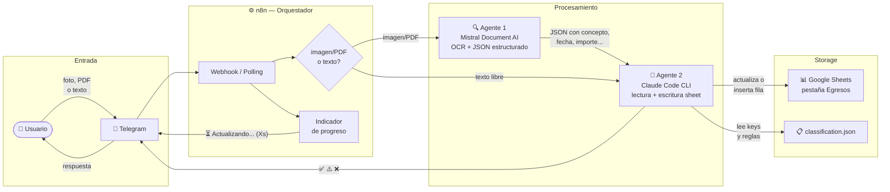

# ia-update-cuentas-personales

> **⚠️ Proyecto en construcción** — en uso activo y evolución continua. La estructura, prompts y configuración pueden cambiar entre iteraciones.

Automatización de gastos personales: el usuario envía un comprobante (imagen/PDF) o un mensaje de texto por Telegram, y el sistema extrae los datos, los clasifica y actualiza una planilla Google Sheets — sin intervención manual.

**Proyecto de uso personal**, adaptado a un formato de planilla específico documentado en `docs/sheet-structure.md`. Usar como referencia o punto de partida requiere adaptar esa estructura y el system prompt del Agente 2 a la propia planilla.

También es un espacio de aprendizaje y exploración de las tecnologías involucradas: una excusa para satisfacer la curiosidad y experimentar estrategias de construcción creativa en conjunto con IA.

---

## Vista previa

### Planilla de gastos (Google Sheets)



### Workflow en n8n



## Demo


---

## Arquitectura



---

## Stack

| Componente | Tecnología |
|---|---|
| Orquestador | n8n self-hosted (Docker, puerto 5678) |
| OCR | Mistral Document AI (`mistral-ocr-latest`) |
| Agente de escritura | Claude Code CLI (Agente 2) |
| Storage | Google Sheets (Service Account) |
| Entrada | Telegram Bot |
| Túnel público | zrok2 (desarrollo) / Cloudflare Tunnel (producción) |

---

## Setup inicial

### Requisitos

- Docker + Docker Compose
- Node.js 18+ (para `npx`)
- `jq` instalado en el host
- Claude Code CLI: `npm install -g @anthropic-ai/claude-code`
- Cuenta Mistral con plan Experiment o superior
- Google Cloud project con Sheets API habilitada

### 1. Clonar con submodule

```bash
git clone --recurse-submodules https://github.com/LucianoDlf/ia-update-cuentas-personales
cd ia-update-cuentas-personales
```

Si ya clonaste sin `--recurse-submodules`:

```bash
git submodule update --init --recursive
```

### 2. Variables de entorno

```bash
cp .env.example .env
```

| Variable | Descripción |
|---|---|
| `BOT_TOKEN` | Token del bot de Telegram (desde @BotFather) |
| `API_KEY_MISTRAL` | API key de Mistral (mistral.ai) |
| `AGENT2_SHEET_ID` | ID del Google Sheet a actualizar |
| `ZROK_TOKEN` | Token para túnel zrok2 (zrok.io) |
| `N8N_ACTIVATE_WORKFLOWS` | IDs de workflows n8n separados por coma |

También completar `services/n8n/.env` desde `services/n8n/.env.example`.

### 3. Credenciales Google (Service Account)

El Agente 2 accede a Google Sheets mediante una Service Account de Google Cloud.

**Pasos:**

1. Crear un proyecto en [Google Cloud Console](https://console.cloud.google.com)
2. Habilitar la **Google Sheets API**
3. Crear una **Service Account** y descargar la clave JSON
4. Compartir el Google Sheet con el email de la service account (permiso Editor)
5. Generar la configuración MCP:

```bash
make init CREDENTIALS=/ruta/al/service-account-key.json
```

Este comando lee el JSON descargado, extrae `project_id` y la ruta absoluta a las credenciales, y genera `scripts/agent2-mcp.json` a partir del template `scripts/agent2-mcp.json.example`.

> `scripts/agent2-mcp.json` y `.secrets/` están en `.gitignore` — nunca se suben al repositorio.

> La sección de setup de credenciales se ampliará con capturas de pantalla.

### 4. Configurar túnel zrok2 (para webhooks de Telegram)

n8n necesita una URL pública accesible desde internet para recibir webhooks de Telegram. En desarrollo local se usa zrok2.

**Instalar zrok2** (si no está instalado): [zrok.io](https://zrok.io)

**Crear un nombre fijo para el share:**

```bash
# Autenticarse con el token de zrok (ZROK_TOKEN del .env)
zrok2 enable <tu-zrok-token>

# Crear un nombre reservado (reemplazar "mi-n8n-local" con el nombre que prefieras)
zrok2 create name -n public mi-n8n-local
```

El nombre creado determina la URL pública: `https://mi-n8n-local.<zona>.zrok.io`

**Configurar en `.env`** (raíz del proyecto):

```
ZROK_NAME=mi-n8n-local
N8N_PORT=5678
```

También completar `WEBHOOK_URL` en `services/n8n/.env` con la URL pública resultante:

```
WEBHOOK_URL=https://mi-n8n-local.<zona>.zrok.io/
```

**Comandos útiles de zrok2:**

```bash
zrok2 list names          # Ver nombres reservados y su URL
zrok2 list shares         # Ver shares activos
zrok2 status              # Estado general
zrok2 delete name <nombre>  # Eliminar un nombre reservado
```

> **Nota:** zrok2 es un túnel pensado para desarrollo. Para producción, considerar [Cloudflare Tunnel](https://developers.cloudflare.com/cloudflare-one/connections/connect-networks/) como alternativa permanente.

### 5. Iniciar el entorno

```bash
# Entorno 100% operativo
make start ZROK=1 ACTIVATE=1

# Solo docker (sin túnel ni activación)
make start
```

---

## Modos de uso

### Modo texto

El usuario escribe directamente en Telegram:

```
Monotributo $74500
Gas listo
IIBB 36700
panadería $3.200
```

El Agente 2 identifica el gasto en `classification.json`, busca la fila correspondiente en el sheet y actualiza fecha, importe y estado.

### Modo imagen/PDF (OCR)

El usuario envía una foto o PDF del comprobante, con caption opcional:

```
[foto del ticket] → caption: "Farmacia"
[PDF de Monotributo]
```

**Agente 1** (Mistral Document AI) extrae del documento:

| Campo | Descripción |
|---|---|
| `concepto` | Nombre del comercio o servicio |
| `detalle_inferido` | Clave de clasificación inferida del documento |
| `fecha` | Fecha del pago en DD/MM/YYYY |
| `importe` | Monto total como número |
| `observacion` | Datos de trazabilidad (CBU, CUIT, referencia) |

El caption del usuario tiene máxima prioridad: si coincide con una clave en `classification.json`, se asigna directamente sin analizar el documento.

**Agente 2** recibe el JSON del OCR y ejecuta la misma lógica que en modo texto.

---

## Componentes

### Agente 1 — OCR (`scripts/test-mistral-ocr.py`)

Script Python que invoca Mistral Document AI con un prompt de extracción estructurada. Soporta PDF e imágenes (JPG, PNG). Acepta un caption opcional como segundo argumento.

```bash
python scripts/test-mistral-ocr.py samples/receipts/20260417-CompraSuper.jpg "Super"
```

El resultado se guarda en `samples/extracted/<nombre>.json` y se imprime en stdout.

### Agente 2 — Escritura en sheet (`scripts/agent2.sh`)

> **Nota de diseño:** el Agente 2 usa **Claude Code CLI** (`claude`) como runtime en lugar de llamar directamente a la Anthropic API. Es una decisión deliberadamente experimental: Claude Code CLI tiene soporte nativo de MCP servers, lo que permite al agente usar herramientas como `mcp-gsheets` sin escribir código de tool-use desde cero. La alternativa convencional sería un script Python con el SDK de Anthropic, tool use manual y un cliente de Google Sheets API — funcional pero más verboso. Este enfoque cambia "escribir infraestructura de agente" por "escribir un system prompt + configurar MCP", y es parte de la exploración de hasta dónde se puede llegar con esa estrategia.

Wrapper bash que invoca Claude Code CLI con system prompt, MCP server de Google Sheets y modo sin persistencia de sesión. El log se escribe en tiempo real.

Flujo interno (definido en `scripts/agent2-system-prompt-latest.txt`):

1. Carga `classification.json` y metadata del sheet en paralelo
2. Parsea el input (texto libre o JSON del OCR)
3. Normaliza fecha e importe
4. Identifica el item aplicando prioridades: caption → detalle_inferido → concepto OCR → matching general
5. Si `is_precargado: true` → busca fila existente y actualiza; si `false` → inserta nueva
6. Responde con `✅`, `⚠️` o `❌`

Para monitorear en tiempo real:

```bash
tail -f logs/agent2.log
```

### `classification.json`

Define los items conocidos con sus reglas de matching y escritura:

```json
{
  "lista_fijos": {
    "Monotributo": {
      "keys": ["monotributo", "monot"],
      "concepto": "Monot+Impuestos",
      "detalle": "Monotributo",
      "is_precargado": true
    }
  },
  "lista_variables": {
    "Super": {
      "keys": ["super", "supermercado", "almacen"],
      "concepto": "Super",
      "detalle": null,
      "is_precargado": false
    }
  }
}
```

- `is_precargado: true` → busca la fila del mes y la actualiza
- `is_precargado: false` → inserta una fila nueva directamente
- `detalle: null` → no modifica columna G si la fila ya existe
- El matching ignora mayúsculas, acentos y puntuación

### Google Sheet — `docs/sheet-structure.md`

El Agente 2 opera sobre una estructura de sheet específica documentada en `docs/sheet-structure.md`. Este archivo fue generado con asistencia de un agente de análisis que leyó la planilla existente y documentó tabs, columnas, patrones de importe, valores válidos y reglas de escritura.

Si se usa una planilla diferente, es necesario regenerar `docs/sheet-structure.md` (proceso asistido por agente) y adaptar el system prompt del Agente 2.

---

## Comandos

### Ciclo completo

```bash
make start                          # Levanta n8n + PostgreSQL
make start ZROK=1                   # + inicia túnel zrok2
make start ACTIVATE=1               # + activa workflows en n8n
make start ZROK=1 ACTIVATE=1        # Todo junto (entorno 100% operativo)

make stop                           # Detiene n8n
make stop ZROK=1                    # + detiene túnel zrok2
make stop ACTIVATE=1                # + desactiva workflows antes de detener
make stop ZROK=1 ACTIVATE=1         # Todo junto
```

### Setup

```bash
make init CREDENTIALS=/ruta/key.json   # Genera scripts/agent2-mcp.json
```

### Workflows

```bash
make activate-workflows             # Activa workflows (lee N8N_ACTIVATE_WORKFLOWS del .env)
make deactivate-workflows           # Desactiva workflows
```

### Docker (bajo nivel)

```bash
make n8n-up      # Levanta n8n + PostgreSQL
make n8n-down    # Detiene n8n
make n8n-logs    # Logs en tiempo real
make n8n-status  # Estado de contenedores
```

---

## Estructura del repositorio

```
scripts/
  agent2.sh                        # Wrapper bash — invoca Claude CLI como Agente 2
  agent2-system-prompt-latest.txt  # System prompt del Agente 2 (versión actual)
  agent2-mcp.json.example          # Template MCP config (make init genera el real)
  agent2-stream-parse.sh           # Parser del stream-json de Claude para logs legibles
  classification.json              # Reglas de clasificación de gastos
  test-mistral-ocr.py              # Script de prueba OCR (Agente 1)

services/n8n/                      # Submodule: n8n-shbase (docker compose + config)

workflows/n8n/                     # Workflows exportados desde n8n (sanitizados)
  fase-3b-v2-telegram-ocr-agente2.json
  error-handler-telegram.json

samples/
  receipts/                        # 2 comprobantes de muestra incluidos en el repo
    20260417-CompraSuper.jpg        # Ejemplo: ticket de supermercado (gasto variable)
    20260417-PagoObraSocial.jpeg   # Ejemplo: pago de servicio (gasto fijo)
  extracted/                       # JSONs generados por OCR — no trackeados

docs/
  sheet-structure.md               # Estructura y reglas de la planilla Google Sheets

.env.example                       # Variables de entorno requeridas
```

---

## Submodule `services/n8n`

`services/n8n/` apunta al repositorio [n8n-shbase](https://github.com/LucianoDlf/n8n-shbase). Contiene el docker compose, Makefile y configuración de la instancia n8n.

Para actualizar el submodule a la última versión:

```bash
git submodule update --remote services/n8n
```

Para propagar cambios al repositorio del submodule:

```bash
cd services/n8n && git add -p && git commit && git push
cd ../.. && git add services/n8n && git commit -m "chore: actualizar submodule n8n"
```

---

> TMP: revisar túnel Cloudflare como alternativa permanente a zrok2
> https://blog.cloudflare.com/es-es/ridiculously-easy-to-use-tunnels/
